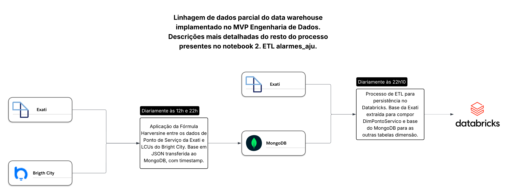

# PUC-RIO-MVP-Eng-Dados
MVP da disciplina Engenharia de Dados do curso Ciências de Dados and Analytics da PUC Rio.

O trabalho foi organizado em três notebooks do databricks.
1. Catálogo, Esquema e Tabelas
2. ETL alarmes_aju
3. Perguntas e Respostas MVP

# Objetivo
Será utilizado dados coletados diariamente de alarmes de um sistema de telegestão baseado em dispositivos IoT semelhantes a relés utilizados em iluminação pública. Esses dispositivos IoT são chamados de LCU e a cidade em que o sistema de telegestão é aplicado possui 10.500 LCUs instaladas em luminárias LED nas grandes avenidas.

Será criado um DW baseado no esquema estrela com quatro dimensões e uma tabela fato. Esse DW será, então, utilizado para responder perguntas de negócio que auxiliarão a gerência a tomar decisões mais precisas.
Maiores detalhes sobre metadados podem ser encontrados no notebook "1. Catálogo, Esquema e Tabelas".

### Perguntas de negócio

1. Números de alarmes por altura de poste.
2. Número de Alarmes no trimestre do contrato atual por altura do poste.
3. Número de alarmes no último ETL
4. Número de alarmes resolvidos no trimestre do contrato.
5. Número de alarmes resolvidos por dia do Trimestre do Contrato.
6. LCUs com maior frequência de alarmes nos últimos 30 dias.
7. LCUs com maior frequência de alarme Aceso Durante o Dia nos últimos 30 dias.
8. LCUs com dias consecutivos com alarme Acesa Durante o Dia.
9. Número de LCUs com Alarmes recorrentes.
10. Alarmes por bairro no trimestre do contrato.

As perguntas com descrições mais detalhadas e suas respostas podem ser encontradas no notebook "3. Perguntas e Respostas MVP".

# Coleta e Carga de Dados
Os dados coletados foram dos sites Exati e Bright City que são sistemas de gestão operacionais contratados pela Concessionária de Iluminação Pública Conecta Aracaju, empresa em que trabalho atualmente. O site Bright City é o da telegestão e nele não existe maneira de obter dados históricos de alarmes. Só é possível ver o momento atual dos alarmes, tornando difícil a análise de dados.

Os dados utilizados nesse trabalho não são sensíveis e estão, de forma indireta, publicas pela prefeitura de Aracaju, com dados de números de ocorrências e atendimentos.

A etapa de Coleta e Carga de dados está presente e documentada no notebook "2. ETL alarmes_aju" e a uma imagem da linhagem parcial dos dados .png "MVP-Linhagem-Dados-Parcial.png" está disponível para consulta nesse repositório.

Foi criado um cronograma do databricks (job) que executa esse notebook todos os dias, tendo uma média de 200 registros novos na tabela fato.

# Autoavaliação
Foi extremamente satisfatório fazer esse MVP.

Todas as perguntas criadas eram, na verdade, questões do nosso dia a dia na empresa que não conseguíamos muitas vezes responder. Somente as questões relacionadas ao dia atual podiam ser respondidas com facilidade e as outras dependiam que todos os dias fosse exportado um relatório em Excel do sistema, pois não existe um banco de dados no sistema de telegestão contratado em que seja possível fazer consultas gerenciais.

Quando comecei a criar o MVP não imaginava o quão podereso seria ter os dados bem organizados em uma estrutura de DW. Com os dados obtidos foi possível perceber padrões que antes nem sequer tínhamos noção que aconteciam.

Um desses casos foi relacionado a pergunta de número 8. Nós tínhamos uma noção que existiam algumas LCUs que mantiam a luminária LED acesa durante o dia, gerando o alarme "Acesa Durante o Dia", porém, quando realizei a consulta no DW, tive como resposta quase 100 LCUs que tinham esse comportamento em apenas 30 dias de dados coletados. Esse número é muito superior ao que imaginamos inicialmente.

Inclusive, em relação a pergunta de número 8, foi criado um relatório baseado nos resultados da consulta, que foi enviado à empresa responsável pelo sistema de telegestão, que reconheceu existir algum tipo de anomalia no dispotivo IoT.

Finalizando, todos os objetivos foram alcançados e os resultados foram bem melhores do que as expectativas iniciais.
